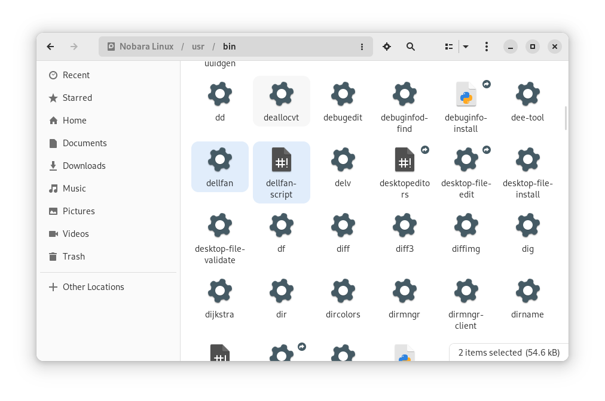
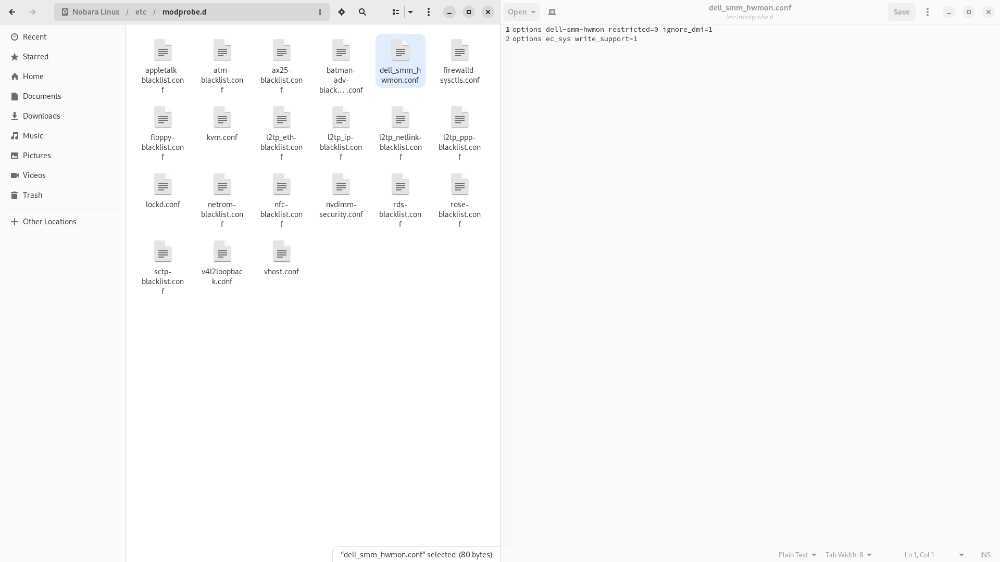
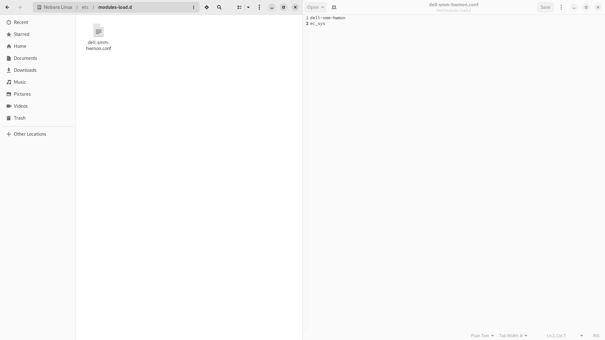
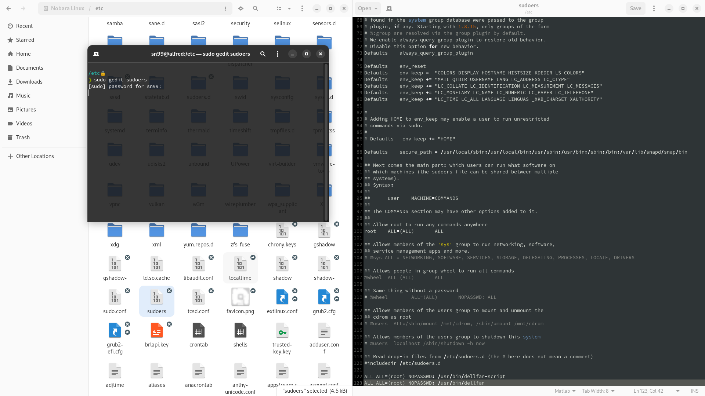
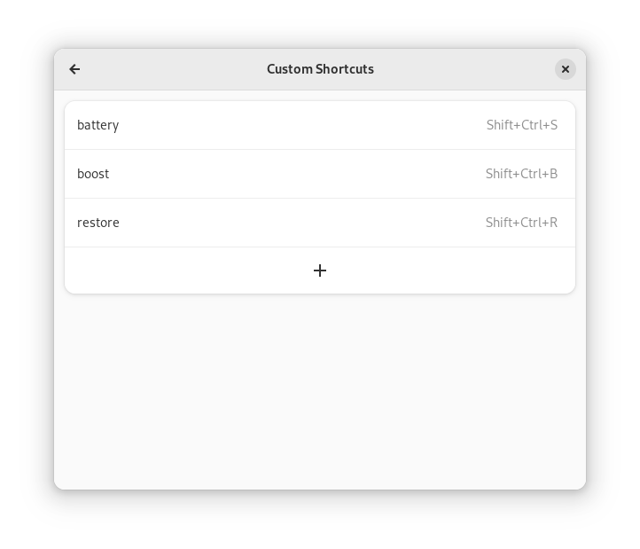

# Dell G5 SE 5505 - Linux

I have been using this setup for gaming(aka game-mode) and power saving mode for around 2 years now, thought I would
share. This is specifically for [G5 15 SE Gaming Laptop](https://www.dell.com/ae/p/g-series-15-5505-laptop/pd).

The idea is to have 3 separate profiles for gaming, general use and battery life.

**Restart your system after making all of these changes.**

## Compiling

1. Head over to [DavidLapous/DellG5SE-Fan-Linux](https://github.com/DavidLapous/DellG5SE-Fan-Linux)
2. Download the `DellFan.cpp` and compile it using `g++ -std=c++17 -O2 -march=zen2 -Wall DellFan.cpp -o dellfan`
3. Next in
   terminal `sudo grubby --args "processor.ignore_ppc=1 amdgpu.ppfeaturemask=0xffffffff ec_sys.write_support=1" --update-kernel=ALL`

You don't need to follow other steps mentioned
in [DavidLapous/DellG5SE-Fan-Linux](https://github.com/DavidLapous/DellG5SE-Fan-Linux) as I will go over them again
here,
but it is a good idea to read them.

## Script

The script is at [`dellfan-script`](dellfan-script). Copy and paste it alongside the binary we just created
in `/usr/bin`.
The script itself just changes fan speed and CPU/GPU power profiles.

**In Gnome, you can use `sudo nautilus` for an easy copy and paste.**



## Kernel-modules

1. Copy and paste [`dell_smm_hwmon.conf`](dell_smm_hwmon.conf) into `/etc/modprobe.d`



2. Similarly, copy and paste [`dell-smm-hwmon.conf`](dell-smm-hwmon.conf) into `/etc/modules-load.d`



**If the module `ec_sys` doesn't exists it means your kernel wasn't build with it,
try [compiling your own kernel](https://github.com/sn99/Optimizing-linux#compiling-your-kernel)
with `CONFIG_ACPI_EC_DEBUGFS=m` flag or setup [DKMS](https://wiki.archlinux.org/title/Dynamic_Kernel_Module_Support).**

## Sudoers

We now need to give sudo access to this particular script and program so that we can use it with keyboards shortcuts.

1. It should be located in `/etc` and named `sudoers`
2. Use `sudo gedit sudoers` to open it
3. Paste this at the end of the file:

```
ALL ALL=(root) NOPASSWD: /usr/bin/dellfan-script
ALL ALL=(root) NOPASSWD: /usr/bin/dellfan
```



## Keyboard shortcuts

You might have to find where you can make your own keyboard shortcuts specific to your distro, on
Gnome `Settings -> Keyboard -> Keyboard Shortcuts -> View and Customize Shortcuts -> Custom Shortcuts -> +`



The shortcuts themselves bind to:

- `sudo dellfan-script s` for battery
- `sudo dellfan-script b` for boost/gaming
- `sudo dellfan-script r` for normal use

## More performance??

Go through [Optimizing-linux](https://github.com/sn99/Optimizing-linux).

### Contributing & Help

Feel free to raise any [issue](https://github.com/sn99/DellG5SE-Linux/issues/new) for queries.